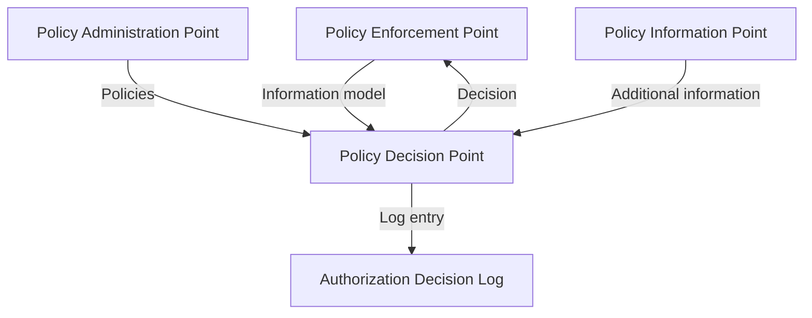
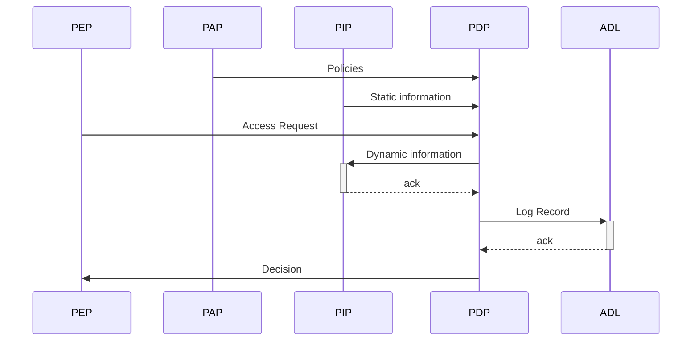

# Architecture

This section describes the common EAM architecture within which the authorization decision are logged.

Expand this section with

- Federated
- Inbound and outbound
- Trace context (W3C context)
- Follow request over all layers (internal and external)
- LDV

## Context

The Authorization Decision Logs defines a standard format for recording decisions made by Externalized Access Management (EAM) systems .

The goal of the standard is to enable reconstitution of the environment in which historical authorization decisions were made to enable evaluation and exploration of decision while preventing unneccesary data duplication.

The inputs to the Authorization Decision Log come from the following standard EAM or PxP components as introduced in [[NIST.SP.800-162]] and adopt the information model introduced in the [[AuthZEN]].

<figure>

<figcaption>EAM or PxP Architecture</figcaption>
</figure>

## Components

The standard access control architecture has the following conceptual components. These can be deployed as standalone applications or combined in various configurations.

### Authorization Decision Log

The Authorization Decision Log contains all information that was used in the authorization decision. Using the Authorization Decision Log it SHOULD be possible to accurately recreate environmental factors which affected historical authorization decisions.  

### Policy Enforcement Point (PEP)

A Policy Enforcement Point (PEP) intercepts a user's request, sends it to the Policy Decision Point (PDP) for evaluation, and then enforces the resulting "permit" or "deny" decision. PEPs are typically implemented as API gateways or as components within the application itself.

### Policy Administration Point (PAP)

A Policy Administration Point (PAP) is where access policies are authored, managed, and stored. It is responsible for distributing current policies to the PDP and archiving previous versions for traceability. This can be a commercial tool or a version control system like a Git repository.

### Policy Information Point (PIP)

A Policy Information Point (PIP) enriches access requests with additional attributes needed to make a decision. For example, it might retrieve a user's role or the sensitivity level of a data record from an external source. PIPs are often integrated directly into the PDP.

### Policy Decision Point (PDP)

A Policy Decision Point (PDP) evaluates incoming request from the PEP against the relevant policies (from the PAP) and contextual data (from the PIP) to make a "permit" or "deny" decision. The PDP is often a separate application or sidecar container.

## Scope

This section delineates the scope of the standard.

### No specification for the management of logs
The specification defines an interface for persisting log entries. This is the component that MUST be consistent across organizations to ensure interoperability. The management of a Logbook, however, is left to the discretion of individual implementations.
Consequently, the specification does NOT define behavior or interfaces for:
- deleting or modifying log entries
- managing access to the Logbook
- ensuring long-term accessibility
- handling archiving or deletion of log entries

## Flows

### Writing a log record after an authorization decision

<figure>

<figcaption>Writing a log record after an authorization decision</figcaption>
</figure>

To provide accountability for historical authorization decisions it must be possible to recreate the information and environment that affected the decision. The PDP provides the information required for this to the Authorization Decision Log in the form of a Log Record as defined in the specification below. 

The PDP **SHOULD** await acknowledgement from the Authorization Decision Log providing the Policy Enforcement Point with the decision. This ensures that the log record has been persisted and can be used to provide accountability when needed.