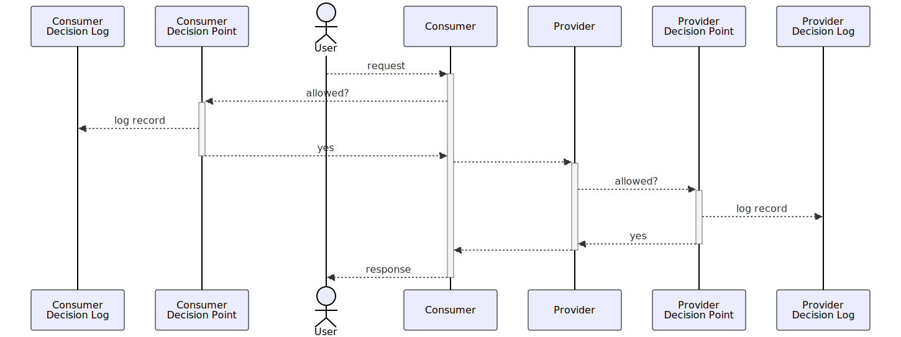

# Architecture

This section describes the common EAM architecture within which the authorization decisions are logged.

## Context

The Authorization Decision Log defines a standard format for recording decisions made by Externalized Authorization Management (EAM) systems.

The goal of the standard is to enable recreation of the environment in which historical authorization decisions were made to enable analysis of decisions while preventing unnecessary data duplication.

The inputs for records in the Authorization Decision Log come from the following standard EAM or PxP components as introduced in [[?NIST.SP.800-162]] and adopt the information model introduced in [[AuthZEN]].

<figure>

<figcaption>EAM or PxP Architecture</figcaption>
</figure>

In a federated context both consumer (outbound) and provider (inbound) decisions can be logged using this standard. When combined with tracing headers such as [[trace-context]] introduced by [[?Logboek dataverwerkingen]] this enables traceability across complex multi-organizational processing chains.

See the sequence diagram below for an example of such a flow. The [[trace-context]] will be included in every request and can thus be used as request identifier in the Authorization Decision Log.

<figure>

<figcaption>Decision logging in federated context</figcaption>
</figure>

## Components

The standard EAM architecture has the following conceptual components. These can be deployed as standalone applications, combined in various configurations, or even implemented within a single monolithic application. 

### Authorization Decision Log

The Authorization Decision Log contains all information that was used in the authorization decision. Using the Authorization Decision Log it SHOULD be possible to accurately recreate environmental factors that affected historical authorization decisions.  

### Policy Enforcement Point (PEP)

A Policy Enforcement Point (PEP) intercepts a user's request, sends it to the Policy Decision Point (PDP) for evaluation, and then enforces the resulting "permit" or "deny" decision. A PEP is typically implemented as an API gateway or as a component within the application itself.

### Policy Administration Point (PAP)

A Policy Administration Point (PAP) is where access policies are authored, managed, and stored. It is responsible for distributing current policies to the PDP and archiving previous versions for traceability. This can be a dedicated commercial or open-source tool or a version control system like a Git repository.

### Policy Information Point (PIP)

A Policy Information Point (PIP) enriches access requests with additional attributes needed to make a decision. For example, it might retrieve a user's role or the sensitivity level of a data record from an external source. PIPs are often integrated directly into the PDP.

### Policy Decision Point (PDP)

A Policy Decision Point (PDP) evaluates incoming requests from the PEP against the relevant policies (from the PAP) and contextual data (from the PIP) to make a "permit" or "deny" decision. The PDP is often a separate application or sidecar container.

It is important to keep in mind that these are architectural components. They can also be physically implemented in a single application. In such a case the authorization interceptor can be considered the PEP, the authorization handler the PDP, the services it invokes the PIP and the Git repository of the application itself the PAP.

## Scope

This section delineates the scope of the standard.

### No specification for the management of logs
The specification defines an interface for persisting log entries. This is the component that MUST be consistent across organizations to ensure interoperability. The management of a log, however, is left to the discretion of individual implementations.
Consequently, the specification does NOT define behavior or interfaces for:
- deleting or modifying log entries
- managing access to the log
- ensuring long-term accessibility
- handling archiving or deletion of log entries

## Flows

### Writing a log record after an authorization decision

<figure>

<figcaption>Writing a log record after an authorization decision</figcaption>
</figure>

To provide accountability for historical authorization decisions it must be possible to recreate the information and environment that affected the decision. The PDP provides the information required for this to the Authorization Decision Log in the form of a Log Record, as defined in the specification below. 

The PDP **SHOULD** await acknowledgement from the Authorization Decision Log before providing the Policy Enforcement Point with the decision. This ensures that the log record has been persisted and can be used to provide accountability when needed.
