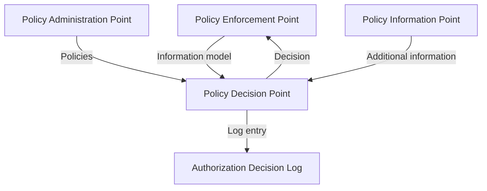
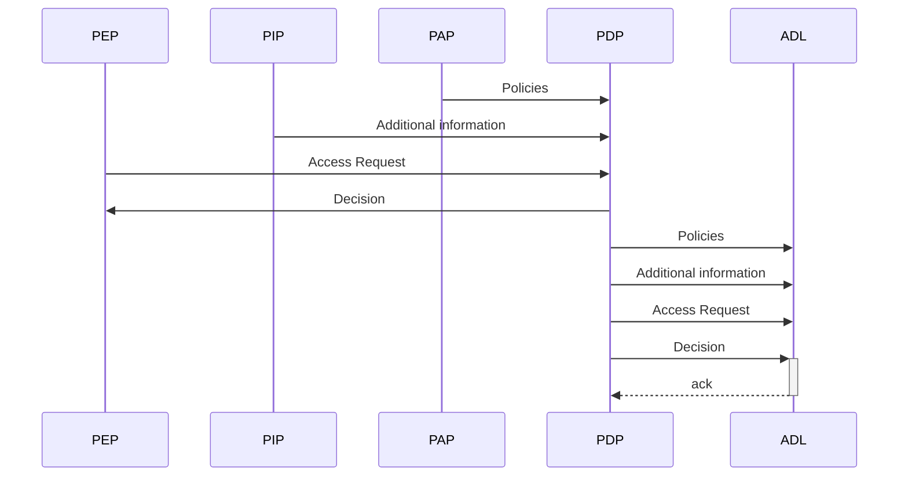

# Architecture

This section describes the common EAM architecture within which the authorization decision are logged.

## Context

The Authorization Decision Logs defines a standard format for recording decisions made by Externalized Access Management (EAM) systems .

The goal of the standard is to enable reconstitute the environment of historical decisions to enable replay and analysis while preventing unneccesary data duplication.

The inputs to the Authorization Decision Log come from the following standard EAM or PxP components as introduced in {{NIST.SP.800-162}}.

<figure>

<figcaption>EAM or PxP Architecture</figcaption>
</figure>

## Components

De standaard architectuur voor toegangsverlening kent de volgende conceptuele componenten. Deze componenten kunnen als losstaande applicaties worden neer gezet maar ook in verschillende samenstellingen gecombineerd worden.

### Policy Enforcement Point (PEP)

Een Policy Enforcement Point (PEP) ontvangt verzoeken tot gegevensverwerking en is in staat deze uit te voeren of af te wijzen. 

Een Policy Enforcement Point is verantwoordelijk voor het: 
- samenvatten van het verwerkingsverzoeken in een afgesproken informatiemodel
- aanbieden van het informatiemodel aan een Policy Decision Point
- opvolgen van de instructies in de door de Policy Decision Point geretourneerde toegangsbeslissing

Policy Enforcement Points bestaan over het algemeen uit gateways die 'voor' de applicatie staan of uit componenten binnen de applicatie het Policy Decision Point aanroepen.

### Policy Administration Point (PAP)

Een Policy Administration Point maakt op gecontroleerde en herleidbare wijze beleidsregels beschikbaar aan één of meerdere Policy Decision Points. 

Een Policy Administration Point is verantwoordelijk voor het: 
- beschikbaar maken van actuele beleidsregels aan Policy Decision Points
- archiveren van historische beleidsregels
- gecontroleerd uitrollen van nieuwe en aangepaste beleidsregels

Er zijn meerdere commerciële Policy Administration Points beschikbaar. Aangezien een Policy Administration Point vooral geversioneerde deployments nodig heeft kan een Git-repository ook als PAP fungeren. 

### Policy Information Point (PIP)

Een Policy Information Point (PIP) kan het door de Policy Enforcement Point samengestelde informatiemodel verrijken met additionele informatie indien nodig. 

Een Policy Information Point is verantwoordelijk voor het:
- uitbreiden van het informatiemodel met (semi-)statisch informatie
- uitbreiden van het informatiemodel met dynamische informatie
- herleidbaar maken welke informatie gebruikt is voor historische toegangsbeslissingen

In de praktijk worden Policy Information Points veelal in de PDP geïntegreerd. Let hierbij echter wel op dat de verwantwoording van gebruikte informatie gewaarborgd blijft.

### Policy Decision Point (PDP)

Een Policy Decision Point (PDP) beslist op basis van beschikbare informatie of een verwerkingsverzoek toegestaan of afgewezen dient te worden.

Een Policy Decision Point is verantwoordelijk voor het: 
- verrijken van het informatiemodel met behulp van informatie uit het Policy Information Point
- beschikbaar hebben van de autorisatieregels
- evalueren van verwerkingsverzoeken op basis van het informatiemodel en de actuele autorisatieregels

Een Policy Decision Point is veelal een externe applicatie of een sidecar/container die naast de applicatie draait. Het kan echter ook een component binnen de applicatie zijn. In dat geval dient wel extra aandacht te worden besteed aan het centraal beschikbaar maken van logs voor verantwoording.

### Authorization Decision Log

The Authorization Decision Log contains all information that was used in the authorization decision. Using the Authorization Decision Log it SHOULD be possible to recreate historical access decisions.  

## Scope

In deze sectie wordt de scope van de standaard afgebakend.

### No specification for the management of logs
The specification defines an interface for persisting log entries. This is the component that MUST be consistent across organizations to ensure interoperability. The management of a Logbook, however, is left to the discretion of individual implementations.
Consequently, the specification does NOT define behavior or interfaces for:
- deleting or modifying log entries
- managing access to the Logbook
- ensuring long-term accessibility
- handling archiving or deletion of log entries

## Flows

### Wegschrijven van een logregel na een toegangsbeslissing

<figure>

<figcaption>Evalueren van toegangsbeslissingen</figcaption>
</figure>
Om toegangsbeslissingen snel uit te kunnen voeren maakt het Policy Administration Point autorisatieregels pro-actief beschikbaar aan het Policy Decision Point. Waar mogelijk maakt het Policy Informatie Point ondersteunende informatie ook pro-actief beschikbaar aan het Policy Decision Point.

Na het ontvangen van het informatiemodel van een verwerkingsverzoek haalt het Policy Decision Point met behulp van het Policy Information Point dynamische informatie op indien nodig. 
Daarna evalueert het policy decision point het verwerkingsverzoek op basis van het samengestelde informatiemodel en de autorisatieregels. De resulterende toegangsbeslissing, inclusief [verantwoordingsidentifiers](#verantwoordingsidentifiers), worden aan het Policy Enforcement Point aangeleverd.

Deze informatie wordt daarna in het Authorization Decision Log opgeslagen.

